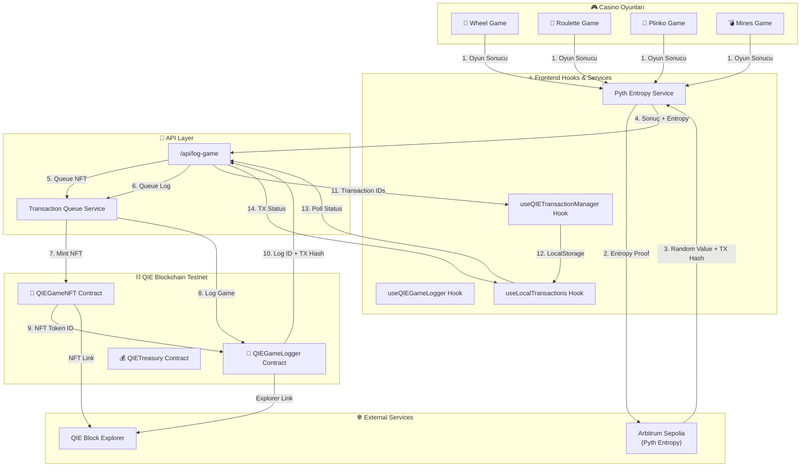
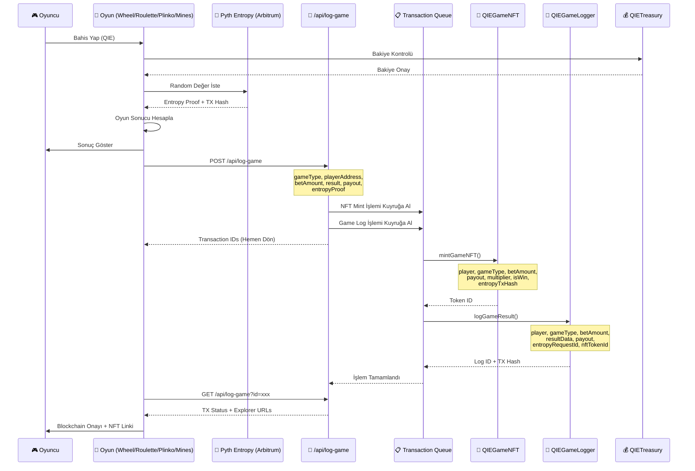
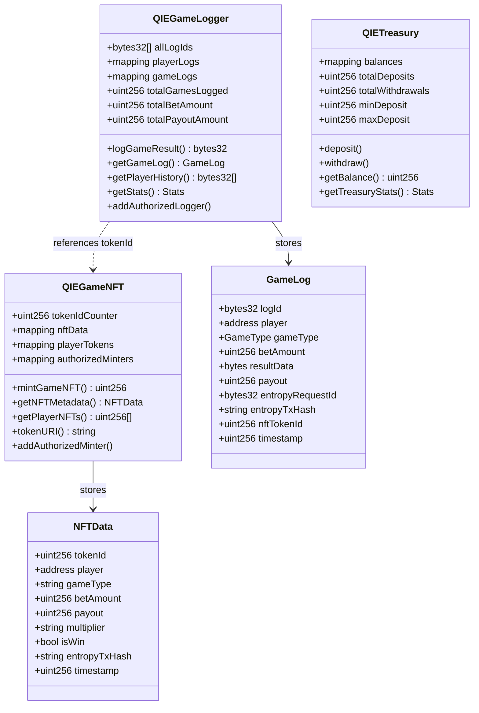
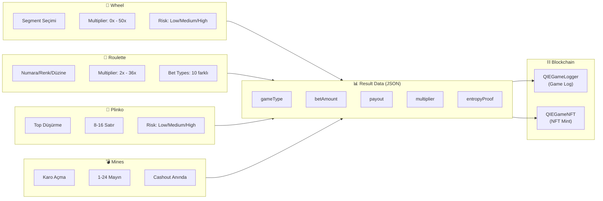
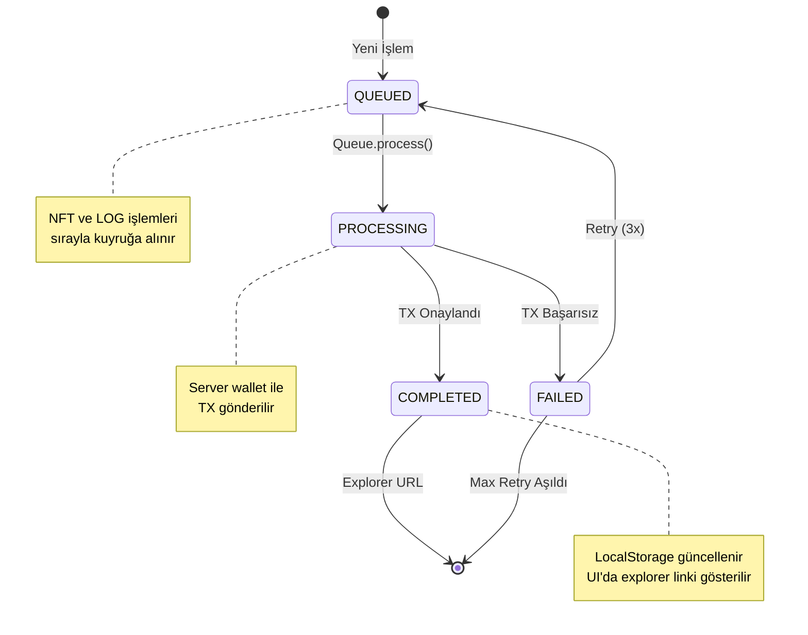

# QIE Blockchain ve NFT Mimarisi - Casino Oyunları

Bu döküman, projede QIE Blockchain ve NFT'lerin 4 oyun (Wheel, Roulette, Plinko, Mines) ile nasıl entegre edildiğini açıklar.

## Genel Akış Diyagramı

## Detaylı Kontrat Etkileşim Diyagramı

## Kontrat Yapısı Diyagramı

## Oyun Bazlı Veri Akışı

## Transaction Queue İşlem Akışı

## Özet

| Bileşen | Görev |
|---------|-------|
| **QIEGameLogger** | Oyun sonuçlarını blockchain'e kaydeder, istatistik tutar |
| **QIEGameNFT** | Her oyun için ERC-721 NFT mint eder, on-chain metadata |
| **QIETreasury** | QIE deposit/withdraw işlemleri, bakiye yönetimi |
| **Pyth Entropy** | Arbitrum Sepolia üzerinden provably fair randomness |
| **Transaction Queue** | Sıralı TX işleme, retry mekanizması |
| **useQIETransactionManager** | Frontend'de TX takibi, localStorage sync |

## Kullanılan Ağlar

- **QIE Blockchain Testnet**: Ana oyun loglama ve NFT mint
- **Arbitrum Sepolia**: Pyth Entropy randomness kaynağı
