# QIE Blockchain ve NFT Mimarisi - Casino Oyunları

Bu döküman, projede QIE Blockchain ve NFT'lerin 4 oyun (Wheel, Roulette, Plinko, Mines) ile nasıl entegre edildiğini açıklar.

## Genel Akış Diyagramı

```mermaid
flowchart TB
    subgraph Oyunlar["🎮 Casino Oyunları"]
        WHEEL["🎡 Wheel Game"]
        ROULETTE["🎰 Roulette Game"]
        PLINKO["📍 Plinko Game"]
        MINES["💣 Mines Game"]
    end

    subgraph Frontend["⚛️ Frontend Hooks & Services"]
        useQIEGameLogger["useQIEGameLogger Hook"]
        useQIETransactionManager["useQIETransactionManager Hook"]
        useLocalTransactions["useLocalTransactions Hook"]
        PythEntropy["Pyth Entropy Service"]
    end

    subgraph API["🔌 API Layer"]
        LogGameAPI["/api/log-game"]
        TransactionQueue["Transaction Queue Service"]
    end

    subgraph QIEBlockchain["⛓️ QIE Blockchain Testnet"]
        QIEGameLogger["📝 QIEGameLogger Contract"]
        QIEGameNFT["🎨 QIEGameNFT Contract"]
        QIETreasury["💰 QIETreasury Contract"]
    end

    subgraph External["🌐 External Services"]
        ArbitrumSepolia["Arbitrum Sepolia\n(Pyth Entropy)"]
        QIEExplorer["QIE Block Explorer"]
    end

    %% Oyun Akışları
    WHEEL --> |"1. Oyun Sonucu"| PythEntropy
    ROULETTE --> |"1. Oyun Sonucu"| PythEntropy
    PLINKO --> |"1. Oyun Sonucu"| PythEntropy
    MINES --> |"1. Oyun Sonucu"| PythEntropy

    PythEntropy --> |"2. Entropy Proof"| ArbitrumSepolia
    ArbitrumSepolia --> |"3. Random Value + TX Hash"| PythEntropy

    PythEntropy --> |"4. Sonuç + Entropy"| LogGameAPI
    
    LogGameAPI --> |"5. Queue NFT"| TransactionQueue
    LogGameAPI --> |"6. Queue Log"| TransactionQueue

    TransactionQueue --> |"7. Mint NFT"| QIEGameNFT
    TransactionQueue --> |"8. Log Game"| QIEGameLogger

    QIEGameNFT --> |"9. NFT Token ID"| QIEGameLogger
    QIEGameLogger --> |"10. Log ID + TX Hash"| LogGameAPI

    LogGameAPI --> |"11. Transaction IDs"| useQIETransactionManager
    useQIETransactionManager --> |"12. LocalStorage"| useLocalTransactions

    useLocalTransactions --> |"13. Poll Status"| LogGameAPI
    LogGameAPI --> |"14. TX Status"| useLocalTransactions

    QIEGameLogger --> |"Explorer Link"| QIEExplorer
    QIEGameNFT --> |"NFT Link"| QIEExplorer
```

## Detaylı Kontrat Etkileşim Diyagramı

```mermaid
sequenceDiagram
    participant Player as 🎮 Oyuncu
    participant Game as 🎰 Oyun (Wheel/Roulette/Plinko/Mines)
    participant Pyth as 🔮 Pyth Entropy (Arbitrum)
    participant API as 🔌 /api/log-game
    participant Queue as 📋 Transaction Queue
    participant NFT as 🎨 QIEGameNFT
    participant Logger as 📝 QIEGameLogger
    participant Treasury as 💰 QIETreasury

    Player->>Game: Bahis Yap (QIE)
    Game->>Treasury: Bakiye Kontrolü
    Treasury-->>Game: Bakiye Onay
    
    Game->>Pyth: Random Değer İste
    Pyth-->>Game: Entropy Proof + TX Hash
    
    Game->>Game: Oyun Sonucu Hesapla
    Game->>Player: Sonuç Göster
    
    Game->>API: POST /api/log-game
    Note over API: gameType, playerAddress,<br/>betAmount, result, payout,<br/>entropyProof
    
    API->>Queue: NFT Mint İşlemi Kuyruğa Al
    API->>Queue: Game Log İşlemi Kuyruğa Al
    API-->>Game: Transaction IDs (Hemen Dön)
    
    Queue->>NFT: mintGameNFT()
    Note over NFT: player, gameType, betAmount,<br/>payout, multiplier, isWin,<br/>entropyTxHash
    NFT-->>Queue: Token ID
    
    Queue->>Logger: logGameResult()
    Note over Logger: player, gameType, betAmount,<br/>resultData, payout,<br/>entropyRequestId, nftTokenId
    Logger-->>Queue: Log ID + TX Hash
    
    Queue-->>API: İşlem Tamamlandı
    
    Game->>API: GET /api/log-game?id=xxx
    API-->>Game: TX Status + Explorer URLs
    
    Game->>Player: Blockchain Onayı + NFT Linki
```

## Kontrat Yapısı Diyagramı

## Oyun Bazlı Veri Akışı

## Transaction Queue İşlem Akışı

```mermaid
stateDiagram-v2
    [*] --> QUEUED: Yeni İşlem
    QUEUED --> PROCESSING: Queue.process()
    PROCESSING --> COMPLETED: TX Onaylandı
    PROCESSING --> FAILED: TX Başarısız
    COMPLETED --> [*]: Explorer URL
    FAILED --> QUEUED: Retry (3x)
    FAILED --> [*]: Max Retry Aşıldı

    note right of QUEUED
        NFT ve LOG işlemleri
        sırayla kuyruğa alınır
    end note

    note right of PROCESSING
        Server wallet ile
        TX gönderilir
    end note

    note right of COMPLETED
        LocalStorage güncellenir
        UI'da explorer linki gösterilir
    end note
```

## Özet

| Bileşen | Görev |
|---------|-------|
| **QIEGameLogger** | Oyun sonuçlarını blockchain'e kaydeder, istatistik tutar |
| **QIEGameNFT** | Her oyun için ERC-721 NFT mint eder, on-chain metadata |
| **QIETreasury** | QIE deposit/withdraw işlemleri, bakiye yönetimi |
| **Pyth Entropy** | Arbitrum Sepolia üzerinden provably fair randomness |
| **Transaction Queue** | Sıralı TX işleme, retry mekanizması |
| **useQIETransactionManager** | Frontend'de TX takibi, localStorage sync |

## Kullanılan Ağlar

- **QIE Blockchain Testnet**: Ana oyun loglama ve NFT mint
- **Arbitrum Sepolia**: Pyth Entropy randomness kaynağı
