# APT Casino - QIE Blockchain 🎰

A production-ready decentralized casino platform built on QIE Blockchain Testnet featuring:
- **QIE Blockchain Integration** - On-chain game logging and NFT minting
- **Pyth Entropy** - Provably fair gaming with cryptographically secure randomness
- **MetaMask Smart Accounts** - Enhanced wallet experience with batch transactions
- **Multi-Network Architecture** - QIE Testnet for gaming, Arbitrum Sepolia for entropy

## 🎮 The Story Behind APT Casino

A few days ago, I was exploring transactions on Etherscan when I saw an advertisement for a popular centralized casino platform offering a 200% bonus on first deposits. I deposited 120 USDT and received 360 USDT in total balance in their custodial wallet.

When I started playing, I discovered I could only bet $1 per game and couldn't increase the amount. After contacting customer support, I learned I had been trapped by hidden "wager limits" tied to the bonus scheme. To withdraw my original deposit, I would need to play $12,300 worth of games!

In a desperate attempt to recover my funds, I played different games all night—roulette, mines, spin wheel—and lost everything.

This frustrating experience inspired APT Casino: a combination of GameFi, AI, and DeFi where users can enjoy casino games in a safe, secure, and transparent environment that doesn't scam its users.

## 🎯 The Problem

The traditional online gambling industry suffers from several issues:

- **Unfair Game Outcomes**: 99% of platforms manipulate game results, leading to unfair play
- **High Fees**: Exorbitant charges for deposits, withdrawals, and gameplay
- **Restrictive Withdrawal Policies**: Conditions that prevent users from accessing their funds
- **Misleading Bonus Schemes**: Trapping users with unrealistic wagering requirements
- **Lack of True Asset Ownership**: Centralized control over user funds
- **User Adoption Barriers**: Complexity of using wallets creates friction for web2 users
- **No Social Layer**: Lack of live streaming, community chat, and collaborative experiences

## 💡 Our Solution

APT Casino addresses these problems by offering:

- **Provably Fair Gaming**: Powered by Pyth Entropy


- **Multiple Games**: Wheel, Roulette, Plinko, and Mines with verifiable outcomes
- **MetaMask Smart Accounts**: Enhanced wallet experience with batch transactions
- **QIE Token**: Native currency for QIE Blockchain Testnet
- **Flexible Withdrawal**: Unrestricted access to funds
- **Transparent Bonuses**: Clear terms without hidden traps
- **True Asset Ownership**: Decentralized asset management
- **Live Streaming Integration**: Built with Livepeer, enabling real-time game streams and tournaments
- **On-Chain Chat**: Supabase + Socket.IO with wallet-signed messages for verifiable player communication
- **Gasless Gaming Experience**: Treasury-sponsored transactions for seamless web2-like experience

## 🌟 Key Features

### 1. Smart Account Integration

- **Batch Transactions**: Multiple bets in one transaction
- **Delegated Gaming**: Authorize strategies to play on your behalf
- **Lower Gas Costs**: Optimized for frequent players
- **Enhanced Security**: Smart contract-based accounts

### 2. Provably Fair Gaming


- **Pyth Entropy**: Cryptographically secure randomness
- **On-Chain Verification**: All game outcomes verifiable
- **Transparent Mechanics**: Open-source game logic

### 3. Multi-Chain Architecture

- **Gaming Network**: QIE Blockchain Testnet (Chain ID: 1983)
- **Entropy Network**: Arbitrum Sepolia (Chain ID: 421614)

### 4. Game Selection

- **Roulette**: European roulette with Smart Account batch betting
- **Mines**: Strategic mine-sweeping with delegated pattern betting
- **Plinko**: Physics-based ball drop with auto-betting features
- **Wheel**: Classic spinning wheel with multiple risk levels

### 5. Social Features

- **Live Streaming**: Integrated with Livepeer for real-time game streams and tournaments
- **On-Chain Chat**: Real-time communication with wallet-signed messages
- **Player Profiles**: NFT-based profiles with gaming history and achievements
- **Community Events**: Tournaments and collaborative gaming experiences

### 6. Web2 User Experience

- **Gasless Transactions**: Treasury-sponsored transactions eliminate gas fees
- **Seamless Onboarding**: Simplified wallet experience for web2 users
- **Familiar Interface**: Web2-like experience with web3 benefits

## 🚀 Getting Started

1. **Connect Wallet**: Connect your MetaMask wallet to QIE Blockchain Testnet
2. **Get Tokens**: Get QIE tokens from the QIE Testnet faucet
3. **Deposit**: Deposit QIE to your treasury balance
4. **Play**: Start playing provably fair games!

### Network Configuration

Add QIE Blockchain Testnet to MetaMask:
- **Network Name**: QIE Testnet
- **RPC URL**: `https://rpc1testnet.qie.digital/`
- **Chain ID**: `1983`
- **Currency Symbol**: `QIE`
- **Block Explorer**: `https://testnet.qie.digital`

### Quick Setup

```bash
# Clone the repository
git clone <repository-url>
cd apt-casino

# Install dependencies
npm install

# Set up environment variables
cp .env.example .env
# Edit .env with your configuration

# Run development server
npm run dev
```

Visit `http://localhost:3000` to see the application.

## 🔷 Smart Account Features

APT Casino leverages MetaMask Smart Accounts for an enhanced gaming experience:

### Delegation Benefits:
- **Auto-Betting Strategies**: Delegate betting permissions to strategy contracts
- **Batch Gaming Sessions**: Play multiple games in a single transaction
- **Session-Based Gaming**: Set time-limited permissions for continuous play
- **Gasless Gaming**: Sponsored transactions for smoother experience

### Usage:
```javascript
// Create a delegation for auto-betting
const createAutoBetDelegation = async (maxBet, timeLimit, gameTypes) => {
  return delegationRegistry.createDelegation({
    delegatee: strategyContract,
    constraints: {
      maxAmount: maxBet,
      validUntil: timeLimit,
      allowedGames: gameTypes
    }
  });
};

// Execute batch bets through delegation
const executeBatchBets = async (bets) => {
  return delegationRegistry.executeDelegatedTransactions({
    delegationId,
    transactions: bets.map(bet => ({
      to: bet.gameContract,
      data: bet.data,
      value: bet.amount
    }))
  });
};
```

## 🏗 System Architecture Overview

```mermaid
graph TB
    subgraph Frontend["Frontend Layer"]
        A[Next.js App] --> B[React Components]
        B --> C[Three.js Games]
        B --> D[Material-UI]
        B --> E[RainbowKit + MetaMask Smart Accounts]
        E --> SA[Smart Account Detection]
        B --> LS[Livepeer Streaming]
        B --> CC[Community Chat]
    end
    
    subgraph State["State Management"]
        F[Redux Store] --> G[React Query]
        G --> H[Local State]
        H --> SAH[Smart Account Hook]
    end
    
    subgraph API["API Layer"]
        I[Next.js API Routes] --> J[Pyth Entropy Endpoints]
        I --> K[Deposit/Withdraw MON]
        I --> L[Game Logic]
        I --> SAA[Smart Account API]
        I --> SC[Socket.IO Chat]
        I --> LP[Livepeer API]
    end
    
    subgraph Gaming["Gaming Network - QIE Testnet"]
        MT[QIE Testnet] --> QIE[QIE Token]
        MT --> DEP[Deposits/Withdrawals]
        MT --> SA_BATCH[Batch Transactions]
        MT --> GAS[Gasless Transactions]
    end
    
    subgraph Entropy["Entropy Network - Arbitrum Sepolia"]
        AS[Arbitrum Sepolia] --> N[CasinoEntropyConsumer]
        N --> O[Pyth Entropy]
        O --> P[Pyth Network]
    end
    
    subgraph Data["Data Layer"]
        Q[PostgreSQL] --> R[User Data]
        Q --> CH[Chat History]
        Q --> PF[Player Profiles]
        S[Redis Cache] --> T[Session Data]
        S --> U[Game State]
        S --> SAC[Smart Account Cache]
        S --> LV[Live Streams]
    end
    
    subgraph Social["Social Layer"]
        LP[Livepeer] --> ST[Streaming]
        SB[Supabase] --> RT[Real-time Chat]
        SIO[Socket.IO] --> MS[Message Signing]
    end
    
    A --> F
    B --> I
    I --> MT
    I --> AS
    I --> Q
    I --> S
    N --> I
    SA --> SAA
    CC --> SC
    LS --> LP
    SC --> SB
    SC --> SIO
    LP --> ST
```

## 🔗 Wallet Connection & Smart Account Flow

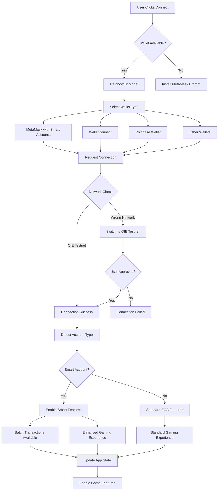

## 🔷 Smart Account Detection & Features

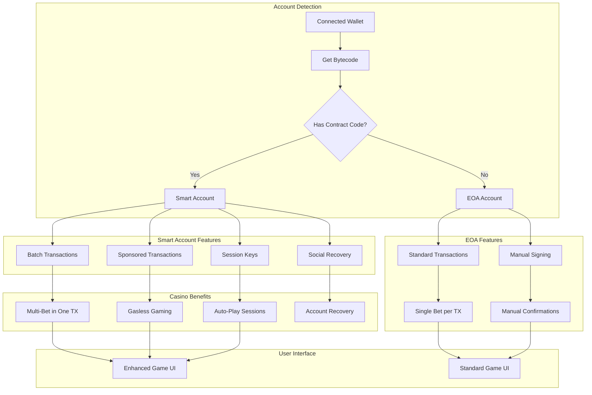

## 🌐 Multi-Network Architecture (QIE Testnet + Arbitrum)

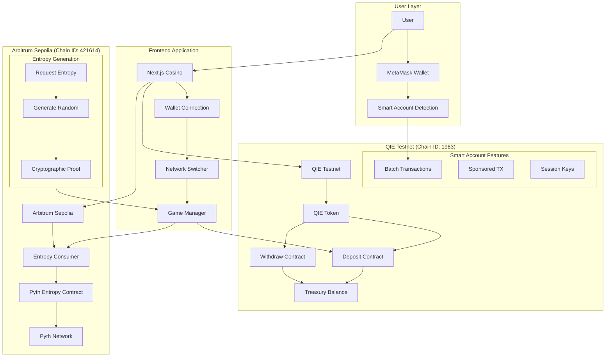

## 🎲 Pyth Entropy Integration Architecture

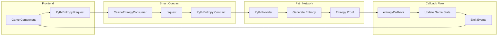

## 🎮 Game Execution Flow (Smart Account Enhanced)

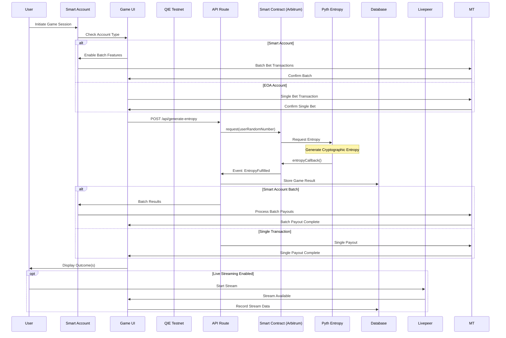

## 🎯 Smart Account Gaming Benefits

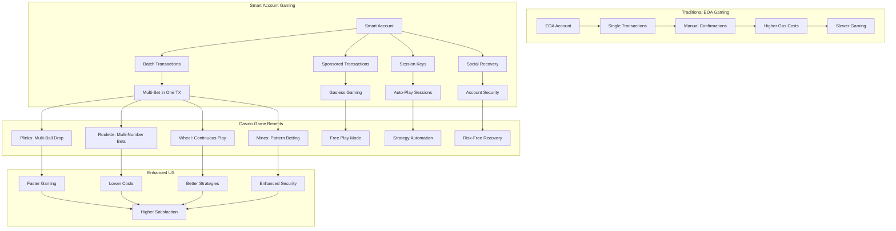

## 🔄 Smart Account Transaction Flow

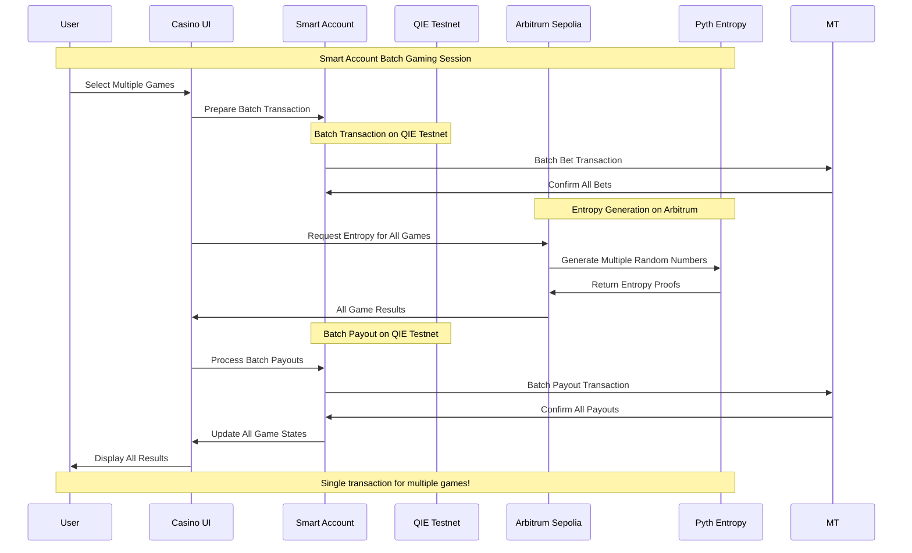


## 🎯 Game Integration with Smart Accounts & Pyth Entropy

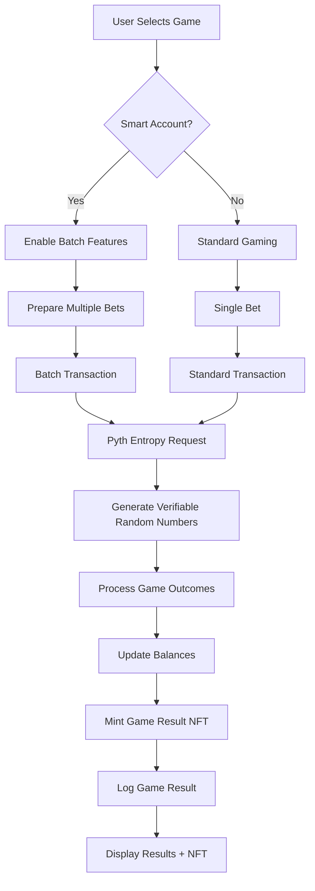

## 🎨 Game Result NFT Architecture

Every game result is automatically minted as an ERC-721 NFT on QIE Blockchain. This section details the complete NFT architecture and flow.

### 🎯 NFT Use Case in Gaming

NFTs in APT Casino serve multiple critical purposes that enhance the gaming experience and solve real problems:

#### 1. **Permanent Proof of Achievement** 🏆
- Every game result is minted as a unique NFT, creating an immutable record of your gaming history
- Players can prove their wins, track their progress, and showcase achievements
- No centralized database can delete or modify your gaming records

#### 2. **Provably Fair Verification** ✅
- Each NFT contains a link to the entropy transaction hash (Pyth Entropy proof)
- Players can verify that game results were truly random and fair
- Complete transparency: every outcome is verifiable on-chain

#### 3. **Gaming History Collection** 📚
- Build a personal collection of all your gaming moments
- Filter by game type (Roulette, Mines, Wheel, Plinko)
- Track wins vs losses, multipliers achieved, and total earnings
- View complete statistics from your NFT collection

#### 4. **Social Sharing & Bragging Rights** 📱
- Share your biggest wins as NFTs on social media
- Each NFT has a unique explorer link that can be shared
- Show off rare multipliers or consecutive wins
- Create a verifiable gaming reputation

#### 5. **True Digital Ownership** 💎
- You truly own your gaming achievements (not the casino)
- NFTs are stored in your wallet, not a centralized database
- Transferable assets (future: trade or sell rare gaming moments)
- Cannot be frozen, deleted, or confiscated

#### 6. **Gamification & Engagement** 🎮
- Collect NFTs from different games to complete your collection
- Rare multipliers create "legendary" NFTs
- Achievement system based on NFT milestones
- Competitive element: compare collections with other players

#### 7. **On-Chain Metadata** 📋
Each NFT contains rich metadata stored on-chain:
- **Game Type**: Roulette, Mines, Wheel, or Plinko
- **Bet Amount**: How much you wagered
- **Payout**: How much you won
- **Multiplier**: The multiplier achieved (e.g., "2.5x", "10x")
- **Win/Loss Status**: Whether the game was won
- **Timestamp**: When the game was played
- **Entropy Proof**: Link to verifiable randomness transaction
- **Visual Image**: Unique NFT image for display

#### 8. **Future Use Cases** 🚀
- **NFT Marketplace**: Trade rare gaming moments
- **Tournament Rewards**: Special NFTs for tournament winners
- **Achievement Badges**: Unlock special NFTs for milestones
- **Staking**: Stake NFTs for rewards or bonuses
- **Cross-Game Integration**: Use NFTs across different games

### 🏗️ NFT Minting Flow

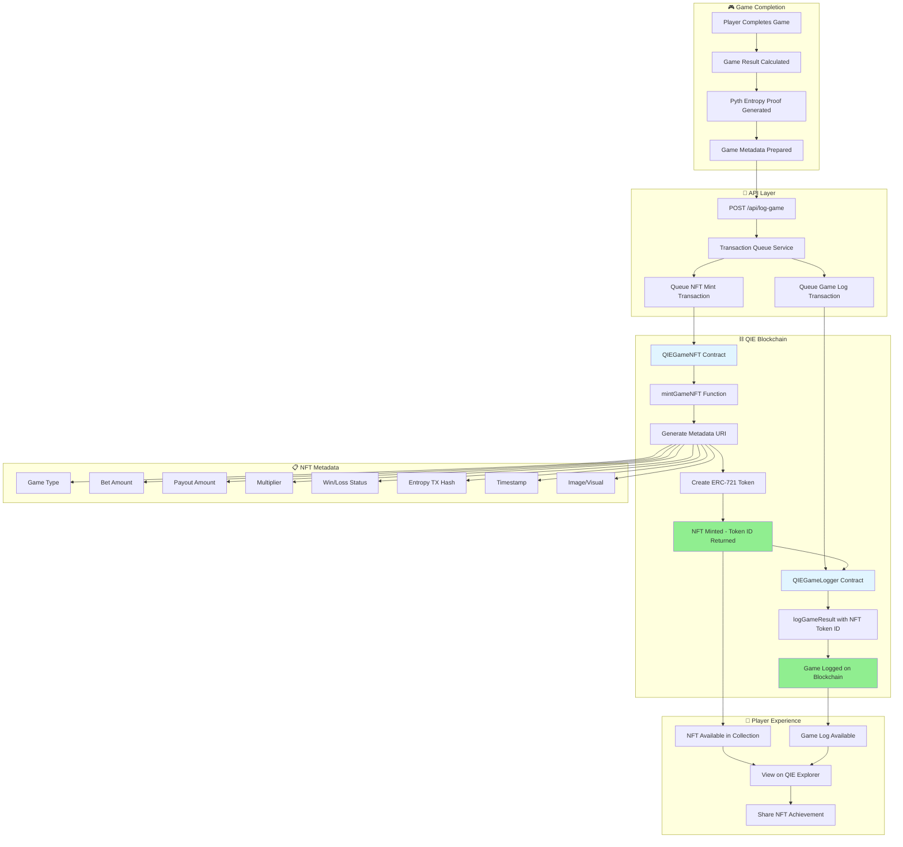

### 🔄 Complete NFT Lifecycle

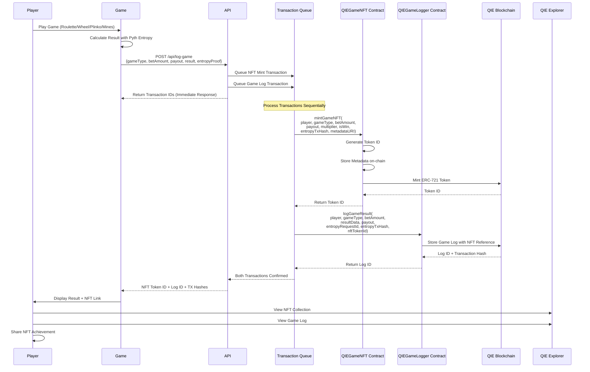

### 📊 NFT Metadata Structure

```mermaid
graph LR
    subgraph NFTMetadata["🎨 NFT Metadata (ERC-721)"]
        A[Token ID] --> B[Player Address]
        B --> C[Game Type]
        C --> D[Bet Amount]
        D --> E[Payout Amount]
        E --> F[Multiplier]
        F --> G[Win/Loss Status]
        G --> H[Entropy TX Hash]
        H --> I[Timestamp]
        I --> J[Metadata URI]
        J --> K[Image/Visual]
    end
    
    subgraph OnChain["⛓️ On-Chain Storage"]
        L[QIEGameNFT Contract] --> M[tokenId → Metadata Mapping]
        M --> N[player → tokenIds[] Mapping]
        N --> O[totalSupply Counter]
    end
    
    subgraph Explorer["🔍 QIE Explorer"]
        P[NFT View] --> Q[Metadata Display]
        Q --> R[Transaction History]
        R --> S[Player Collection]
    end
    
    A --> L
    J --> P
```

### 🎯 NFT Collection Management

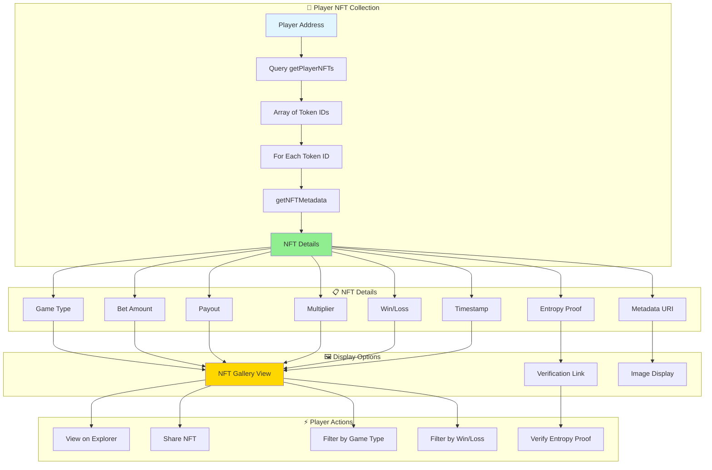

### 🔗 NFT Contract Integration

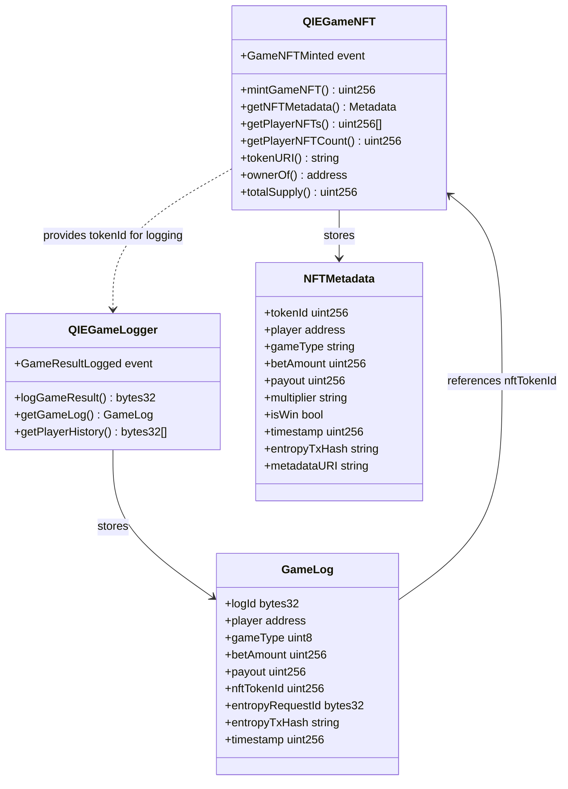

### 💡 Real-World Example: How NFTs Enhance Gaming

**Scenario**: Player completes a Roulette game with a 10x multiplier win

1. **Game Completion**:
   - Player bets 1 QIE on number 7
   - Ball lands on 7
   - Payout: 10 QIE (10x multiplier)

2. **Automatic NFT Minting**:
   - System automatically mints NFT #1234
   - NFT contains: Game Type (ROULETTE), Bet (1 QIE), Payout (10 QIE), Multiplier (10x), Win Status (true)
   - NFT is transferred to player's wallet

3. **Player Experience**:
   - Player sees notification: "🎉 You won! NFT #1234 minted"
   - Click to view NFT on QIE Explorer
   - See complete game details and entropy proof
   - Share achievement: "Just hit a 10x on Roulette! Check my NFT: [link]"

4. **Collection Building**:
   - Player views their NFT collection
   - See all 50 games played as NFTs
   - Filter: "Show only wins" → 20 NFTs
   - Filter: "Show only 10x+ multipliers" → 3 rare NFTs
   - Share collection: "I've won 20 games with 3 legendary multipliers!"

5. **Verification**:
   - Anyone can verify the win by checking the NFT on QIE Explorer
   - Entropy proof link shows the randomness was fair
   - Complete transparency and trust

### 🎮 NFT Integration in Game UI

Players interact with NFTs directly in the game interface:

- **Game History Tab**: Shows all games with NFT links
- **NFT Badge**: Each completed game shows an NFT icon
- **Click to View**: Opens NFT on QIE Explorer
- **Collection View**: Browse all your NFTs in one place
- **Statistics**: Calculate stats from your NFT collection
- **Share Button**: Share your best NFTs on social media

**Example UI Flow**:
```
Game Complete → "NFT Minted!" notification → 
Click NFT icon → Opens QIE Explorer → 
View NFT details → Share link → 
Friends verify your win on-chain
```

## 🔮 Future Roadmap

- **Mainnet Launch**: Deploying on mainnet for real-world use
- **Additional Games**: Expanding the game selection
- **Enhanced DeFi Features**: Staking, farming, yield strategies
- **Developer Platform**: Allowing third-party game development
- **Advanced Social Features**: Enhanced live streaming and chat capabilities
- **ROI Share Links**: Shareable proof-links for withdrawals that render dynamic cards on social platforms
- **Expanded Smart Account Features**: More delegation options
- **Tournament System**: Competitive gaming with leaderboards and prizes

## 📡 QIE Blockchain Integration

**This project demonstrates on-chain gaming using QIE Blockchain** - all game results are permanently logged on-chain with automatic NFT minting for every game.

### 🎯 How QIE Blockchain is Used

APT Casino leverages **QIE Blockchain** to create a transparent, verifiable gaming experience:

- **On-Chain Game Logging**: All game results permanently stored on QIE Blockchain
- **Game Result NFTs**: Every game automatically minted as ERC-721 NFT
- **Verifiable History**: Complete game history queryable from blockchain
- **Transparent Records**: All transactions verifiable on QIE Explorer
- **Immutable Proof**: Each game result linked to entropy proof and transaction hash

### 🏗️ Architecture

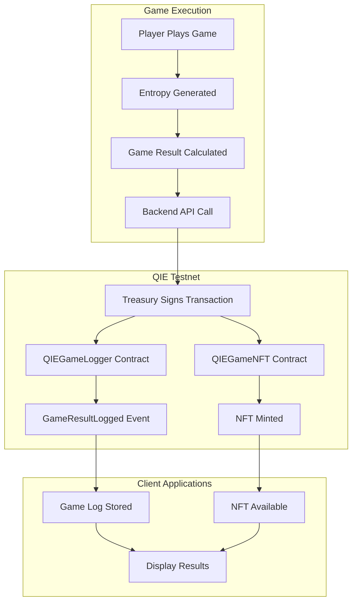

### 🔄 Event Flow

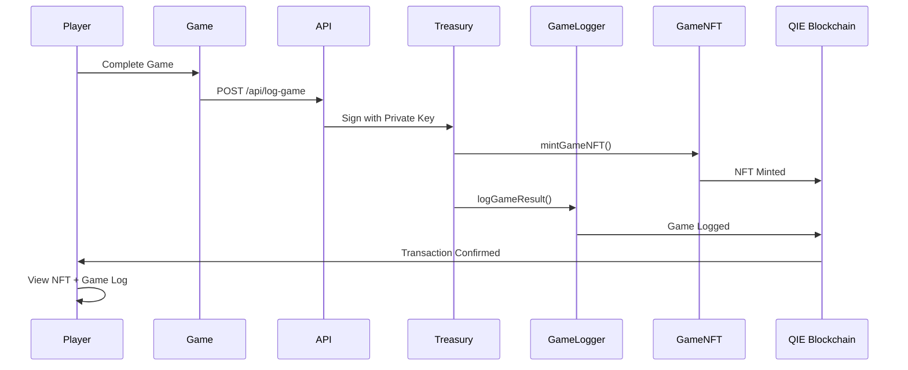

### 📋 QIE Contract Events

**QIEGameLogger Events:**
```solidity
event GameResultLogged(
  bytes32 indexed logId,
  address indexed player,
  uint8 gameType,
  uint256 betAmount,
  uint256 payout,
  bytes32 entropyRequestId,
  string entropyTxHash,
  uint256 nftTokenId,
  uint256 timestamp
);
```

**QIEGameNFT Events:**
```solidity
event GameNFTMinted(
  uint256 indexed tokenId,
  address indexed player,
  string gameType,
  uint256 betAmount,
  uint256 payout,
  bool isWin,
  uint256 timestamp
);
```

### 💻 QIE Blockchain Integration

**Service Architecture:**
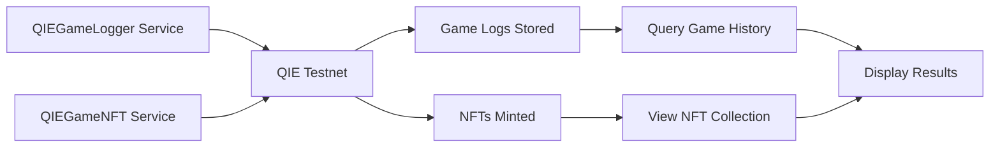

**Key Implementation Files:**
- `src/services/QIEGameLogger.js` - Game logging service
- `src/services/QIEGameNFT.js` - NFT minting service
- `src/hooks/useQIEGameLogger.js` - React hook for game logging
- `src/hooks/useQIEGameNFT.js` - React hook for NFT operations
- `src/config/qieTestnetConfig.js` - QIE network configuration

### 🔌 Usage Example

**1. Log Game Result:**
```javascript
import { QIEGameLogger } from '@/services/QIEGameLogger';

const logger = new QIEGameLogger(provider, signer);

const result = await logger.logGameResult({
  gameType: 'ROULETTE',
  playerAddress: userAddress,
  betAmount: '1.0',
  result: gameResult,
  payout: '2.0',
  entropyProof: entropyResult,
  nftTokenId: nftResult.tokenId
});
```

**2. Mint Game NFT:**
```javascript
import { QIEGameNFT } from '@/services/QIEGameNFT';

const nftService = new QIEGameNFT(provider, signer);

const nftResult = await nftService.mintGameNFT(playerAddress, {
  gameType: 'ROULETTE',
  betAmount: '1.0',
  payout: '2.0',
  multiplier: '2x',
  outcome: 'WIN',
  entropyTxHash: entropyResult.transactionHash
});
```

**3. React Hook Usage:**
```javascript
import { useQIEGameLogger } from '@/hooks/useQIEGameLogger';
import { useQIEGameNFT } from '@/hooks/useQIEGameNFT';

function GameComponent() {
  const { logGame, getExplorerUrl } = useQIEGameLogger();
  const { mintNFT, getPlayerNFTs } = useQIEGameNFT();
  
  const handleGameComplete = async (gameResult) => {
    // Mint NFT first
    const nft = await mintNFT({
      gameType: gameResult.type,
      betAmount: gameResult.bet,
      payout: gameResult.payout,
      multiplier: gameResult.multiplier,
      outcome: gameResult.outcome,
      entropyTxHash: gameResult.entropyTxHash
    });
    
    // Then log game result
    const log = await logGame({
      ...gameResult,
      nftTokenId: nft.tokenId
    });
    
    console.log('NFT:', nft.nftUrl);
    console.log('Game Log:', getExplorerUrl(log.txHash));
  };
  
  return <div>...</div>;
}
```

### ⚡ QIE Blockchain Features

**1. On-Chain Game Logging:**
- All game results permanently stored on QIE Blockchain
- Immutable records with transaction hashes
- Complete game history queryable from blockchain
- Verifiable proof for every game outcome

**2. Game Result NFTs:**
- Automatic NFT minting for every game
- ERC-721 standard NFTs
- On-chain metadata with game details
- Player NFT collections viewable on explorer

**3. Transaction Management:**
- Queue-based transaction processing
- Automatic retry on failure
- Transaction status tracking
- Explorer links for all transactions

**4. Player Experience:**
- View complete game history
- Browse NFT collection
- Verify game results on-chain
- Share NFT achievements

### 📊 Performance Characteristics

**QIE Blockchain:**
- **Transaction Speed:** Fast block times
- **Gas Costs:** Low transaction fees
- **Reliability:** High (EVM-compatible)
- **Explorer:** Full transaction visibility

**NFT Minting:**
- **Automatic:** Every game triggers NFT mint
- **Metadata:** Rich on-chain game data
- **Collection:** Players can view all NFTs
- **Verification:** Each NFT links to game log

### 🧪 Testing QIE Integration

```bash
# Test QIE contracts
node scripts/test-qie-integration.js

# Verify game logger
node scripts/verify-game-logger.js

# Test NFT minting
node scripts/test-nft-minting.js

# Verify all games
node scripts/test-entropy-all-games.js
```

### 🎮 QIE Blockchain Use Case

**Problem Solved:**
Traditional casinos have opaque game results with no verifiable proof. Players cannot verify fairness or maintain a permanent record of their gaming history.

**QIE Blockchain Solution:**
- **Transparent Records**: All games logged on-chain
- **Verifiable Proof**: Each game linked to entropy proof
- **NFT Collection**: Permanent record of gaming achievements
- **Complete History**: Query all games from blockchain

**Example Flow:**
1. Player completes Roulette game
2. Game result calculated with Pyth Entropy proof
3. NFT automatically minted on QIE Blockchain
4. Game result logged to QIEGameLogger contract
5. Player receives NFT link and game log transaction
6. All records permanently stored and verifiable on QIE Explorer

## 🎮 Game Logger

All game results are permanently logged on QIE Blockchain Testnet:

### Features
- **Immutable Records**: All game outcomes stored on-chain
- **Verifiable History**: Transaction links for every game
- **Dual-Network Architecture**: Game logs on QIE, entropy on Arbitrum
- **Automatic Logging**: Non-blocking, fire-and-forget logging

### Smart Contract

```solidity
contract QIEGameLogger {
  function logGameResult(
    address player,
    uint8 gameType,
    uint256 betAmount,
    bytes memory resultData,
    uint256 payout,
    bytes32 entropyRequestId,
    string memory entropyTxHash,
    uint256 nftTokenId
  ) external returns (bytes32 logId);
}
```

### Integration Example

```javascript
import { useQIEGameLogger } from '@/hooks/useQIEGameLogger';

const { logGame, getExplorerUrl } = useQIEGameLogger();

// After game completes and NFT is minted
const txHash = await logGame({
  gameType: 'ROULETTE',
  playerAddress: userAddress,
  betAmount: '1.0',
  result: gameResult,
  payout: '2.0',
  entropyProof: entropyResult,
  nftTokenId: nftResult.tokenId
});

console.log('View on explorer:', getExplorerUrl(txHash));
```

### Environment Variables

Create a `.env` file with the following:

```env
# ============================================
# Supabase Configuration
# ============================================
NEXT_PUBLIC_SUPABASE_ANON_KEY=<your-supabase-anon-key>
NEXT_PUBLIC_SUPABASE_URL=<your-supabase-url>

# ============================================
# WalletConnect Configuration
# ============================================
NEXT_PUBLIC_WALLETCONNECT_PROJECT_ID=<your-walletconnect-project-id>

# ============================================
# QIE Blockchain Configuration
# ============================================
NEXT_PUBLIC_QIE_CHAIN_ID=1983
NEXT_PUBLIC_QIE_RPC_URL=https://rpc1testnet.qie.digital/
NEXT_PUBLIC_QIE_EXPLORER_URL=https://testnet.qie.digital

# QIE Contract Addresses
NEXT_PUBLIC_QIE_TREASURY_ADDRESS=0xacA996A4d49e7Ed42dA68a20600F249BE6d024A4
NEXT_PUBLIC_QIE_GAME_LOGGER_ADDRESS=0x649A1a3cf745d60C98C12f3c404E09bdBb4151db
NEXT_PUBLIC_QIE_GAME_NFT_ADDRESS=0x7F0e5E8B2332F446eDa6488Cba4f4F159efE7F2E

# QIE Server Private Key (for backend operations)
QIE_SERVER_PRIVATE_KEY=<your-qie-server-private-key>

# ============================================
# Pyth Entropy Configuration (Arbitrum Sepolia)
# ============================================
NEXT_PUBLIC_ARBITRUM_SEPOLIA_RPC=https://sepolia-rollup.arbitrum.io/rpc
NEXT_PUBLIC_ARBITRUM_SEPOLIA_EXPLORER=https://sepolia.arbiscan.io

NEXT_PUBLIC_PYTH_ENTROPY_CONTRACT=0x549ebba8036ab746611b4ffa1423eb0a4df61440
NEXT_PUBLIC_PYTH_ENTROPY_PROVIDER=0x6CC14824Ea2918f5De5C2f75A9Da968ad4BD6344

# Arbitrum Sepolia Treasury (for Pyth Entropy operations)
ARBITRUM_TREASURY_PRIVATE_KEY=<your-arbitrum-treasury-private-key>

# ============================================
# Somnia Testnet Configuration (for deposits/withdrawals - backward compatibility)
# ============================================
NEXT_PUBLIC_SOMNIA_TESTNET_RPC=https://dream-rpc.somnia.network
NEXT_PUBLIC_SOMNIA_TESTNET_CHAIN_ID=50311
NEXT_PUBLIC_SOMNIA_TESTNET_EXPLORER=https://somnia-testnet.socialscan.io

SOMNIA_TESTNET_TREASURY_ADDRESS=0xacA996A4d49e7Ed42dA68a20600F249BE6d024A4
SOMNIA_TESTNET_TREASURY_PRIVATE_KEY=<your-somnia-treasury-private-key>

# ============================================
# Treasury Configuration (backward compatibility)
# ============================================
TREASURY_ADDRESS=0xacA996A4d49e7Ed42dA68a20600F249BE6d024A4
TREASURY_PRIVATE_KEY=<your-treasury-private-key>

# ============================================
# Network Configuration
# ============================================
NEXT_PUBLIC_NETWORK=qie-testnet
NEXT_PUBLIC_CHAIN_ID=1983

# ============================================
# Gas & Transaction Limits
# ============================================
GAS_LIMIT_DEPOSIT=21000
GAS_LIMIT_WITHDRAW=100000
MIN_DEPOSIT=0.001
MAX_DEPOSIT=100

# ============================================
# Casino Module Configuration
# ============================================
NEXT_PUBLIC_CASINO_MODULE_ADDRESS=0x0000000000000000000000000000000000000000

# ============================================
# Environment
# ============================================
NODE_ENV=development
NEXT_PUBLIC_APP_ENV=development
```

**⚠️ Security Note**: Never commit your `.env` file to version control. Private keys should be kept secure and only used in backend/server-side code.

### Smart Contract Deployment

```bash
# Deploy contracts to QIE Testnet
npx hardhat run scripts/deploy-qie-contracts.js --network qie-testnet

# Verify deployment
node scripts/test-qie-integration.js
```

### Frontend Deployment

```bash
# Build the application
npm run build

# Deploy to Vercel
vercel deploy

# Or deploy to other platforms
npm run start
```

### Post-Deployment Steps

1. **Authorize Treasury for Game Logger**
   ```bash
   node scripts/authorize-treasury-logger.js
   ```

2. **Authorize Treasury for Game NFT**
   ```bash
   node scripts/authorize-treasury-nft.js
   ```

3. **Test Game Logger**
   ```bash
   node scripts/verify-game-logger.js
   ```

4. **Test NFT Minting**
   ```bash
   node scripts/test-nft-minting.js
   ```

5. **Test All Games**
   ```bash
   node scripts/test-entropy-all-games.js
   ```

**How QIE Blockchain is Used:**
- On-chain game result logging using QIEGameLogger contract
- Automatic NFT minting for every game using QIEGameNFT contract
- Complete game history queryable from blockchain
- Verifiable proof for every game outcome

**Key Implementation:**
- **Service:** `src/services/QIEGameLogger.js`
- **Service:** `src/services/QIEGameNFT.js`
- **Hook:** `src/hooks/useQIEGameLogger.js`
- **Hook:** `src/hooks/useQIEGameNFT.js`
- **Config:** `src/config/qieTestnetConfig.js`

**QIE Blockchain Features:**
- Permanent on-chain game records
- ERC-721 NFTs for every game
- Complete transaction history
- Verifiable on QIE Explorer

**QIE Integration:**
- ✅ Deployed on QIE Testnet (Chain ID: 1983)
- ✅ Smart contracts live and verified
- ✅ Events emitting correctly
- ✅ All transactions verifiable on QIE Explorer
- ✅ NFT minting working for all games

**Potential Impact:**
- Production-ready casino platform on QIE Blockchain
- Perfect showcase for QIE Blockchain gaming use case
- Scalable architecture for thousands of concurrent players
- Well-documented for ecosystem learning

## 📚 Additional Documentation

### Service Documentation
- [QIE Game Logger Service](./src/services/QIEGameLogger.js) - On-chain logging details
- [QIE Game NFT Service](./src/services/QIEGameNFT.js) - NFT minting details
- [QIE Blockchain Architecture](./QIE_BLOCKCHAIN_ARCHITECTURE.md) - Complete architecture documentation

## 🔧 Development

### Running Tests

```bash
# Run all tests
npm test

# Run specific test suite
npm test -- QIEGameLogger
npm test -- QIEGameNFT

# Run with coverage
npm test -- --coverage
```

### Verification Scripts

```bash
# Verify Pyth Entropy (Arbitrum Sepolia)
node scripts/verify-pyth-entropy.js

# Verify Game Logger (QIE Testnet)
node scripts/verify-game-logger.js

# Verify QIE integration
node scripts/test-qie-integration.js

# Verify all games
node scripts/test-entropy-all-games.js

# Verify API routes
node scripts/verify-api-routes.js

# Verify game history
node scripts/verify-game-history-service.js
```

### Project Structure

```
apt-casino/
├── contracts/              # Smart contracts
│   ├── QIETreasury.sol
│   ├── QIEGameLogger.sol
│   └── QIEGameNFT.sol
├── src/
│   ├── app/               # Next.js pages
│   ├── components/        # React components
│   ├── config/            # Network and contract configs
│   │   └── qieTestnetConfig.js
│   ├── hooks/             # Custom React hooks
│   ├── services/          # Business logic services
│   │   ├── QIEGameLogger.js
│   │   └── QIEGameNFT.js
│   └── utils/             # Utility functions
├── scripts/               # Deployment and verification scripts
│   ├── deploy-qie-contracts.js
│   └── test-qie-integration.js
├── docs/                  # Documentation
├── deployments/           # Deployment artifacts
│   └── qie-contracts-*.json
```

## 🔗 Links & Resources

### Live Application
- **Website Link**: [https://apt-casino-eta.vercel.app/](https://apt-casino-eta.vercel.app/)
- **Live Demo**: []()
- **Pitch Deck**: []()
- **Contract Links (QIE Testnet)**: 
  - **QIETreasury**: https://testnet.qie.digital/address/0xacA996A4d49e7Ed42dA68a20600F249BE6d024A4
  - **QIEGameLogger**: https://testnet.qie.digital/address/0x649A1a3cf745d60C98C12f3c404E09bdBb4151db
  - **QIEGameNFT**: https://testnet.qie.digital/address/0x7F0e5E8B2332F446eDa6488Cba4f4F159efE7F2E

### Network Information
- **QIE Testnet Explorer**: https://testnet.qie.digital
- **QIE Testnet RPC**: https://rpc1testnet.qie.digital/
- **Chain ID**: 1983
- **Currency**: QIE
